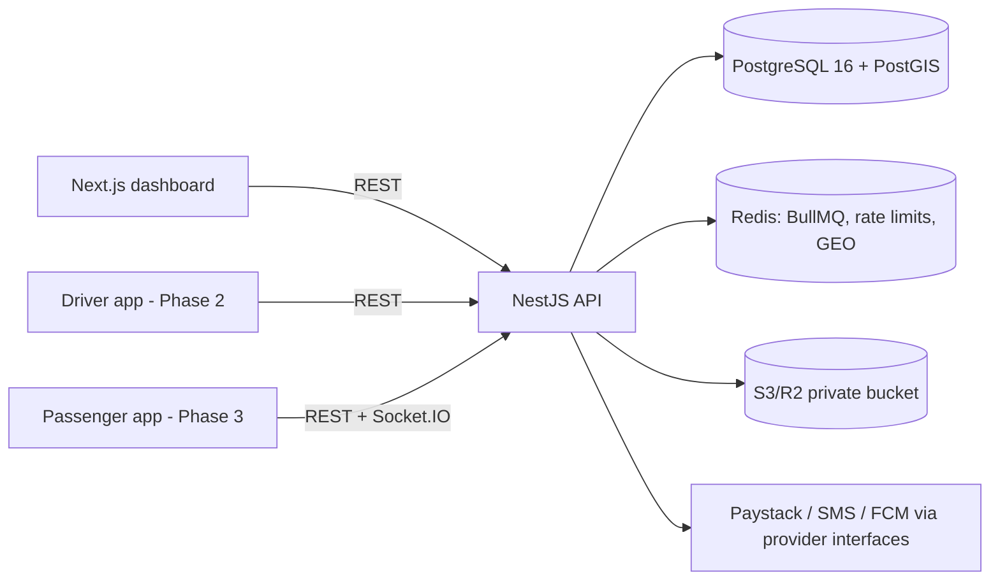

# Architecture

## Overview

## Decisions

- **Modular monolith.** Each business area is a NestJS module with its own service and controller. Modules talk to each other only through exported services, so a module can later be split out.
- **Pure domain logic in `packages/shared`.** This covers Money, state machines, schedule generation and payment allocation. It has no I/O, it is unit-tested, and the apps reuse it.
- **Money is integer pesewas (`bigint` / `BIGINT`).** Balances are always derived from the ledger.
- **Prisma for schema and migrations.** Raw SQL migrations cover what Prisma can't express: partial unique indexes, insert-only triggers and PostGIS. Row locks use `SELECT ... FOR UPDATE` via `$queryRaw` inside interactive transactions.
- **Integration tests use real Postgres through Testcontainers.** Database mocks would hide locking and constraint behaviour.
- **External services sit behind interfaces** (`PaymentProvider`, `SmsProvider`, `MapsProvider`, `StorageProvider`), so providers can be swapped.
