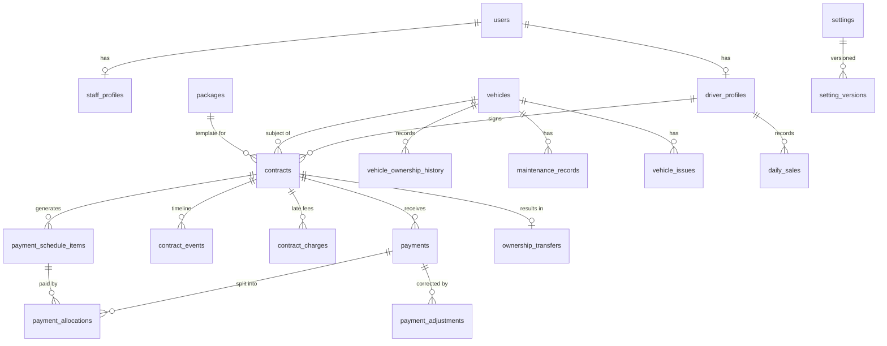

# Data model

This document is kept in sync with `apps/api/prisma/schema.prisma`. Each slice adds its tables here.

## Conventions

- Primary keys are UUIDs (`gen_random_uuid()`).
- Timestamps are `timestamptz`, stored in UTC and displayed in `Africa/Accra`.
- Money columns are `BIGINT` pesewas, with `currency CHAR(3) DEFAULT 'GHS'`.
- `deleted_at` is used for soft deletes on people and vehicles.

## Phase 1 ERD (target)

## Implemented

- `settings`, `setting_versions`: typed business-rule settings. Each change writes a new version row.
